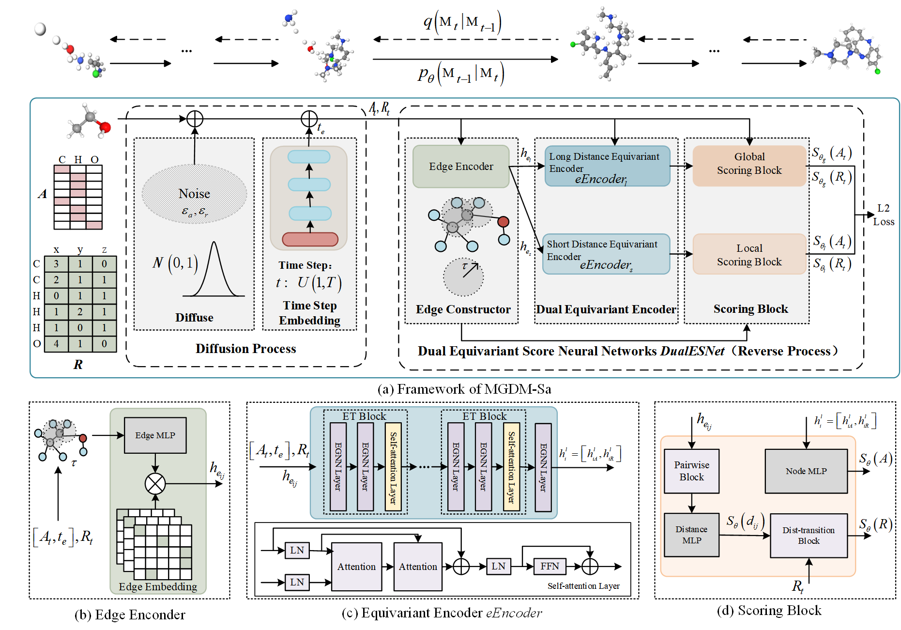

# MGDM: 3D Molecule Generating via Diffusion Model with Self-attention based EGNN



[[Paper](https:)]

## Dependencies

- RDKit
- PyTorch
- Scipy
- torch-scatter
- torch-geometric

You can also clone our environment file.

```bash
# Clone the environment
conda env create -f MGDM.yml
# Activate the environment
conda activate MGDM
```

## Data preparation

### QM9 dataset

Download the dataset and split it.

```bash
cd ./qm9/data/prepare/
python ./qm9/data/prepare/download.py
```

You can also download the data from https://drive.google.com/file/d/1JZ_Z5bjS0RsX_BRWtrplMN9vZpL78-T7/view?usp=drive_link and put it under data/QM9/qm9/raw. 

## Training

### QM9 dataset


```bash
python train.py --config './configs/qm9_full_epoch.yml'
 
```

## Sampling and evaluation  

```bash
python test_eval.py --ckpt <checkpoint> --sampling_type generalized --w_global_pos 1 -- w_global_node 1 --w_local_pos 4 --w_local_node 5
```

## Conditional training and sampling

### Train a conditional MDM for desired properties
```bash
python train_qm9_condition.py --config './configs/qm9_full_epoch.yml' --context {property name} --config_name {config_name}
```
The property name includes homo | lumo | alpha | gap | mu | Cv. For example, you could set --context alpha to train MDM conditioned on alpha.
MDM also supports multiple properties conditioned generation. For example, you could set --context alpha gap to train MDM conditioned on alpha and gap.

### Sampling for evaluation
#### Train a specific classifier
If you would like to train the classifier by yourself
```bash
cd qm9/property_prediction
```
```bash
python main_qm9_prop.py --num_workers 2 --lr 5e-4 --property alpha --exp_name exp_class_alpha --model_name egnn
```
#### Sampling and calculating the MAE loss
```bash
python eval_qm9_condition.py --ckpt {saved_chekpoint} --classifiers_path {saved_cls_checkpoint}
```
You should use the saved checkpoint of train_qm9_condition.py as {saved_checkpoint} and the saved checkpoint of main_qm9_prop.py as {saved_cls_checkpoint}

